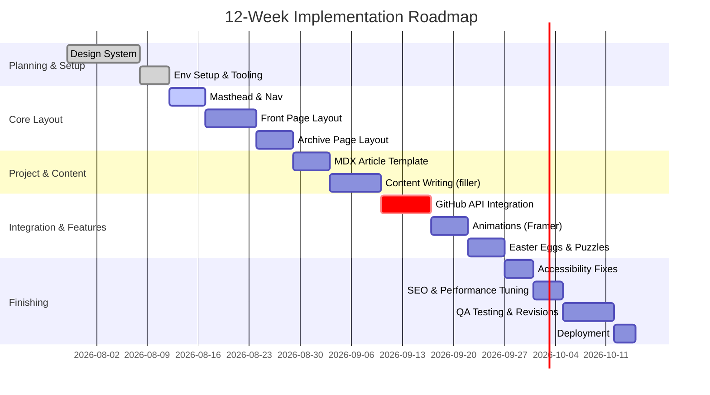

# Executive Summary  
This document defines the **Victorian newspaper–themed developer portfolio** (“The Programmer’s Gazette”) and the supporting **Codex agent guide**. It serves as a single source of truth: a **Product Design Bible** specifying every design, technical, and content decision (Part A, the TRD) and an **Agent Rules & Prompting Guide** (Part B) laying out how an AI agent should implement it. We use Next.js 15 with the new App Router, TypeScript, Tailwind CSS v4, MDX for content, and Framer Motion (MIT‐licensed) for animation. The site is built as an *interactive steampunk newspaper* with pages (masthead, front page, "folds", archives, and project articles) styled like 19th-century print media. Our color palette (`#A72A24`, `#F0F4E3`, `#11191B`, `#976D67`) is defined in Tailwind’s theme with custom tokens, extending the default 11-step scale (50–950). We specify exact fonts (e.g. Libre Bodoni, EB Garamond, Crimson Text, IBM Plex Mono, Special Elite) with Google Fonts links and license notes (all SIL Open Font or Apache 2.0 open licenses). We enforce WCAG 2.1 accessibility (principles Perceivable/Operable/Understandable/Robust), on-page SEO (semantic HTML, metadata close to content), and strict performance/security budgets. The **Agent Guide** describes the Codex agent’s persona, prompt structure, data schemas, error handling, caching (using GitHub’s HTTP ETag/304 mechanism with 60-second freshness), and examples of prompts (e.g. “generate `<Masthead>` component”, “create MDX article from project data”, “fetch and cache GitHub repos”). Each prompt maps to deliverables, tests, and verification steps. Tables catalogue fonts, components, tech stack, API endpoints, acceptance criteria, and CI/CD steps. Mermaid diagrams illustrate the site architecture, component hierarchy, and a 12-week roadmap. This comprehensive spec ensures *any* future developer or AI agent can build the site exactly as envisioned without creative guesswork.  

---

# Part A: Technical Requirements Document (TRD)  

## Vision & Product Philosophy  
**Vision:** A recruiter’s *interactive introduction* to your skills, presented as a genuine-looking Victorian-era newspaper. It combines nostalgia and drama with modern functionality: the front page teases “stories” (project case files), the “folds” hide easter-egg puzzles, and every word (“telegraph interface” instead of API, “editorial amendments” instead of pull requests) is consistent with a steampunk lore we define. The tone is slightly mysterious/thriller-ish, hinting at an alternate 1887 where Ada Lovelace is a leading tech journalist and “bugs” are printing errors.  

**Philosophy:** The portfolio is not just a list of projects; it’s a *performance piece*. The consistent theme immerses the viewer: styling, vocabulary, even the way data is fetched (mock “telegraph networks”) all reinforce the universe. At the same time, it must function flawlessly as a **Next.js/React web app** with good UX (fast, responsive, accessible). Every design choice and prompt is documented here so the implementation is deterministic.  

## Brand Identity & Editorial Language  
- **Publication Name:** *The Programmer’s Gazette* (founded 1887, by Royal Society of Computational Engineers).  
- **Tone/Voice:** Period-accurate formal language with hints of drama/thriller (“mysteries”, “enigma”, “exciting new developments in mechanized computation”). All labels are Victorian-inspired: e.g. *Issues* instead of versions, *Ledger* for resume, *Telegraph* for network requests.  
- **Visual Identity:** Black ink on off-white/sepia paper. The masthead uses an ornate Victorian display font (e.g. Algerian for the logo, fallback to a licensed decorative face). Headlines use Bodoni-classic serifs (Libre Bodoni or Bodoni Moda, SIL OFL). Body text is a readable old-style serif (EB Garamond or Crimson Text). Captions/notes use a lighter serif (Crimson Text/Spectral). Code or console mockups use a monospaced Victorian typewriter font (IBM Plex Mono or Courier Prime) and special “Typewriter” fonts like Special Elite (Apache-2.0) for dial/telegraph effects.  

## Personas  
- **Visitor Persona – Senior Engineer/Recruiter:** A busy professional scanning for competency. Needs to quickly find links to your resume, GitHub, email, and sample code.  
- **Curious Visitor:** Enjoys exploration. Will click the faux-news links, solving easter-egg puzzles.  
- **Accessibility-Needs Visitor:** Uses screen readers or keyboard-only navigation – the site must still convey information (WCAG 2.1 compliant).  

## User Journeys  
1. **Quick Scan (Under 30s):** Recruiter arrives, sees the masthead and nav. Within 30 seconds they find prominent links: a “Paper Ledger” (resume PDF link), “Author’s Quill” (contact), and “Git Repository” (GitHub profile). We enforce this by including a visible navigation bar or sidebar with those links (and checklist in QA:  “Find [Resume, GitHub, Contact] within 30s” acceptance test).  
2. **Project Exploration:** Click on a headline (e.g. “Deep Learning Inventions Unveiled”) which opens a “project case file” article. The article shows problem, solution, tech used, and a link to GitHub code. The user reads code excerpts via an MDX-rendered component.  
3. **Archive Browsing:** The user explores the “Folds” (special past issue pages) to find hidden achievements (e.g. a puzzle that when solved reveals a secret section).  
4. **Contact:** At any point, user can use the footer or masthead to email or view resume.  

## Information Architecture (IA)  
We use Next.js App Router so folder structure *maps to URLs* (benefit: SEO-friendly, predictable routes). The top-level routes include: `/` (Front Page), `/issue/[year]/[month]` (Archived issues), `/projects/[slug]` (Project articles), `/ledger` (resume), `/contact`, etc.  

```mermaid
flowchart TD
    A[Next.js App] --> B[Masthead (Header + Nav)]
    A --> C[Footer]
    A --> D[Main Content]
    D --> E[Front Page / "Edition" (with Projects Teasers)]
    D --> F[Project Case File (MDX)]
    D --> G[Archive Pages]
    D --> H[Folds (Hidden Challenges)]
    D --> I[Resume (Ledger)]
    D --> J[Contact]
    B --> K[Navigation Menu: *Ledger, *Git Repository, *Quill (Email)]
    E -.-> F
    E -.-> G
    G --> F
    H -.-> F
```
*Figure: Site structure in a Victorian-era metaphor. “Ledger”=Resume, “Quill”=Contact, etc.*  

## Page-by-Page Specifications  

- **Masthead (Site Header):** Displays *The Programmer’s Gazette* title in large Algerian or a licensed alternative, with the edition date and tagline (e.g. “Special Engineering Edition”). Font size ~64px on desktop. Background: solid off-white with faint border ornament (e.g. a scanned Victorian border graphic).  
  - **Nav Links:** Teaser links styled as sidebar or topbar: “The Paper Ledger” (Resume PDF), “Git Repository” (link to GitHub), “Author’s Quill” (mailto link), and language switch (if applicable). These must be obvious (per UX rule: [Resume, GitHub, Contact] in nav). 
  - **Accessibility:** Use `<nav>` landmark, ARIA labels, high-contrast ratio (dark ink #11191B on cream #F0F4E3, ~WCAG AA or AAA). 
- **Front Page (Home Edition):** Simulates a newspaper front page. Contains: 
  - A large *headline* story (the “flagship project”), with an eye-catching title in Bodoni. 
  - Below or to the side, “columns” (grid) with 2–3 featured projects with teasers. Each teaser is a card with a thumbnail (e.g. project screenshot framed like an old photo), title, summary text (styled as drop cap + justified columns).  
  - A “sidebar ad” or “telegram” box linking to external profile (like StackOverflow as a faux telegraph update), if needed. 
  - All text styled with justified paragraphs and indent first lines, evoking printed columns. 
  - **Buttons/Links:** Decorative (e.g. subtle shading to look like engraved buttons). 
- **Inner “Folds” (Hidden Pages):** These are accessible via Easter eggs (e.g. clicking the newspaper masthead opens a “special edition” with a logic puzzle or an animated secret). They must degrade gracefully if not found (i.e. hidden, not in normal nav). Use Next.js dynamic routes. 
- **Archive/Issue Pages:** List past “issues” by month/year. Clicking an issue shows its contents (similar layout to front page). 
- **Project Case File UI:** When a user clicks a teaser, we load a `/projects/[slug]` page (Next.js MDX content). Each project article is formatted like a newspaper article: headline, subhead, author byline (“By [Your Name]”), date, sections for Synopsis, Implementation, Technologies, Outcomes. Include code snippets (rendered via MDX) in a styled `<pre>` block (font=IBM Plex Mono, with subtle “typewriter” background image). At the end, a footer linking to the live code on GitHub (“View the full code on GitHub Telegraph Interface”). 
- **GitHub Integration UI:** On project pages (or a dedicated “Projects” page), embed a UI that fetches metadata from the GitHub API (stars, last commit date). For example, a component `<GitHubRepoCard>` that calls GitHub’s REST API for a given repo (GET `/repos/{owner}/{repo}`). Display icon + link. Cache results for 1 hour using conditional GET (ETag) to respect rate limits. Provide placeholder UI if offline or on API error (fallback static data or error notice).
- **Footer:** A decorative footer with copyright and 
  - small text “© 1887 Royal Society of Computational Engineers” (faux date).  
  - Contact link and “Powered by Ether” (glossary of punny things).  
  - Ensure footer is in `<footer>` for accessibility.  

## Component Library (Props & States)  
We design a component library of React/TSX components, each documented with its props and state:
- **`<Masthead>`:** Props: `title: string`, `date: string`, `links: {label: string, href: string}[]`. Renders header.  
- **`<ArticleTeaser>`:** Props: `title: string`, `summary: string`, `imageSrc?: string`, `slug: string`. State: none. Renders an article card with link to project page. 
- **`<ProjectArticle>`:** Props: `title: string`, `date: string`, `author: string`, `sections: Array<{heading: string, content: ReactNode}>`, `repoUrl: string`. Renders an MDX-backed article. 
- **`<Footer>`:** Props: none or configuration for links. 
- **`<GitHubRepoCard>`:** Props: `owner: string`, `repo: string`. State: `{stars: number, lastCommit: string}` (fetched). Fetches GitHub API and displays stars & date.  
- **`<PuzzleOverlay>`:** A hidden component that, given some trigger, shows a coded puzzle (for fun). 
- **Utility components:** e.g. `<DecorativeBorder>`, `<DropCap>`, `<TypewriterText>` with optional animated effect (using Framer Motion for printing effect).

State machines:
- Use server‐side data fetching (Next.js `getStaticProps` or `getServerSideProps`) for static content; for dynamic (GitHub API calls), use React hooks (`useEffect`) with caching via HTTP caching or in-memory/Tailwind caches. Provide loading and error states (spinners styled as Victorian gears). 

## Design System  

### Typography  
- **Masthead/Logo:** *Algerian* (or similar licensed display serif) at ~64px. If Algerian is unavailable or needs license, use an alternative like [Unnamed Grotesque by Google Fonts](https://fonts.google.com/) or a paid font with licensing (note in legal). *Fallback:* 'Algerian', serif; mention proprietary license in footnote.  
- **Headlines:** *Libre Bodoni* or *Bodoni Moda* (SIL OFL). Examples: Google Fonts embed `<link href="https://fonts.googleapis.com/css2?family=Libre+Bodoni&display=swap" ...>`.  
- **Body Text:** *EB Garamond* or *Libre Baskerville* (SIL OFL). Embedding example: `<link href="https://fonts.googleapis.com/css2?family=Crimson+Text&display=swap" ...>`, then `font-family: 'Crimson Text', serif;` for Crimson Text.  
- **Captions/Quotes:** *Crimson Text* or *Spectral* (SIL OFL, W3C text). Use italics or small-caps for drop caps.  
- **Monospace:** *IBM Plex Mono* (SIL OFL) for code blocks.  
- **Typewriter/Vintage:** *Special Elite* (Apache 2.0) for decorative “typewriter” captions or stamps. Example embed: `<link href="https://fonts.googleapis.com/css2?family=Special+Elite&display=swap" rel="stylesheet">`.  
- **Fallbacks:** Always include generic fallbacks (e.g. `serif`, `monospace`). Document any paid license needed (e.g. Algerian is licensed to Monotype/Win; if used, note “Licensed under [vendor]” in README).  

### Color Tokens  
Define in `tailwind.config.js` under `theme.extend.colors`:  
| Token Name  | Hex      | Usage             |
|------------|----------|-------------------|
| `paper-red`  | #A72A24 | Headlines, highlights (bold red) |
| `paper-cream`| #F0F4E3 | Background paper color |
| `ink-black`  | #11191B | Main text color (dark) |
| `paper-tan`  | #976D67 | Accents/borders (faded brown) |
- Use `bg-paper-cream` for page background, `text-ink-black` for body text, etc. Contrast is ensured (e.g. #11191B on #F0F4E3 passes WCAG AA/AAA). 
- Example usage: `class="text-ink-black bg-paper-cream"`.
- Citing Tailwind: we extend default palette (which normally has 50–950 scales) with these custom keys.  

### Spacing & Grid  
- **Spacing scale:** Use 8px base. Tailwind defaults (1=0.25rem=4px, 2=8px, 4=16px). Extend if needed. (You can configure in theme.spacing or leave default.) 
- **Grid:** The layout is largely one-column on mobile, two-column on desktop. Use Tailwind’s `grid-cols-2` at `md:` and `lg:` breakpoints for articles. Implement a newspaper column feel (e.g. `md:grid md:grid-cols-2 gap-8`).  
- **Container:** Maximum width ~900px (`max-w-[900px]`) with responsive padding. Use centered container with CSS like `mx-auto px-4 lg:px-0`.  
- **Icons/Images:** All images (photos, demo graphics) get a `.pdf`. Use `next/image` for optimization (though images should be styled to look like aged photos).  

### Motion & Audio (Interaction Language)  
- **Motion:** Use Framer Motion (MIT, see [70†L19-L24]) for subtle UI animations:  
  - Fade-in of masthead text on load (`initial={{opacity:0}} animate={{opacity:1}}` with a 0.5s delay).  
  - Staggered reveal of columns on page load.  
  - Animated page transitions (slide in/out or “page turn” flip using `layoutFlip`).  
  - Button hover effects: small scale-up or letter-spacing expansion.  
  - Avoid generic effects: follow guidance “few meaningful animations”.  
- **Audio:** (Optional) gentle typewriter or printing press click when loading a project. If used, keep volume low and optional. Provide a mute button. (No existing guideline to cite; use discretion.)  

### Accessibility & SEO Requirements  
- **WCAG Compliance:** Follow *Perceivable, Operable, Understandable, Robust* principles. Use semantic HTML: `<header>`, `<nav>`, `<main>`, `<article>`, `<footer>`, etc. Provide alt text for images, `aria-label` for icon links. Ensure >4.5:1 contrast for text. Keyboard navigation must work (Nav menu <button>s, focus outlines).  
- **SEO:**  
  - Descriptive `<title>` and `<meta>` tags for each page. E.g. front page title “The Programmer’s Gazette – [Your Name] Portfolio”.  
  - Use meaningful route names (e.g. `/issue/1887-12` mapping to content) for crawlable URLs.  
  - Place metadata files next to content as recommended (e.g. `metadata.tsx` in the folder with `page.tsx`).  
  - Use `<h1>` for main article titles (mapped from the newspaper headline).  
  - Include structured data (JSON-LD) for articles: “NewsArticle” schema for project pages to hint at article-like content.  
  - Provide `<meta name="robots" content="index,follow">`.  
  - Evaluate with Lighthouse: aim for Performance ≥90, Accessibility ≥90, Best Practices ≥90.  

### Performance Budgets  
- **Initial Load:** < 2MB of compressed assets, < 3s on 3G.  
- **TTFB:** < 500ms (Next.js SSR/CDN).  
- **Largest Contentful Paint:** < 2.5s.  
- Use Next.js image optimization and `<link rel="preload">` for main fonts to avoid layout shift.  
- Font strategy: load primary font (Libre Bodoni) as `font-display: swap` or using Next.js `next/font` for no layout shift.  
- Defer non-critical JS, use `next/script` strategy (if any ad, analytics).  
- **Memory:** The homepage should not load all project MDX; only load individual MDX on demand (via dynamic `import` or `getStaticProps`).  

### Security Considerations  
- Sanitize any MDX content to avoid XSS (use Next.js `next-mdx-remote` with sanitized HTML or remark plugins).  
- Keep dependencies up to date.  
- Use HTTPS (Vercel auto).  
- Store any tokens (for GitHub API) in environment variables, **never** expose on client. If using client for public data, rely on unauthenticated fetch (60/h limit) or embed minimal backend.  
- Content images should be from our domain or trusted CDN.  
- Follow the **Same-Origin Policy**; no third-party trackers.  

### Deployment Pipeline  
- Use GitHub Actions (CI) to lint, type-check, and build the site.  
- On push to main, run `next build` and `next export` (if static) or `next start` (if SSR).  
- Deploy to Vercel or Netlify.  
- Tests should run (`npm test`) on CI.  
- Maintain versioning: tag releases as “v1.0, v1.1, …” after major features.  

## Content Strategy  
- **Filler Articles:** To mimic real newspaper filler, we include background “historical” content. For example:  
  - A short op-ed on *“The Future of the Analytical Engine”*.  
  - A tech puzzle: a cipher that when solved reveals a GitHub link.  
  - News briefs (e.g. a telegram about “code review at the Royal Society”).  
  - All written in old-fashioned style (shorthand voice, antiquated spelling).  
- **Editorial Examples:** Provide template lines, e.g. 
  > *“In today’s front page story, our reporter unveils an ingenious method of pattern recognition, implemented on the wondrous Babbage Engine using card punch tapes…”*  
- **Project Content:** For each project, create a narrative: “Editorial Investigation: *Project X*” describing problem, “Industry response”, etc. Fact-based but with flourish. Use 1st person historical perspective (“We employed modern mechanical logic to achieve….”).  
- **Sample Text:** (can be inserted into Markdown)  
  > *Lorem ipsum dolor sit amet…* (but better to write Victorian-voiced copy).  
  All sample content should be in British spelling (e.g. “favour”, “analyse”) unless it conflicts with user’s actual name preferences.  

## Acceptance Criteria & QA Tests  
- **Structure:** All pages have <nav>, <main>, <footer> landmarks. Page titles and metadata present.  
- **Fonts:** The specified fonts load and fall back properly. Check licenses: e.g. Google Fonts for open fonts. If Algerian is used, a license note (e.g. “Algerian is a registered font; acquired via licensing”) must be in the repo README.  
- **Colors:** Confirm color tokens match the palette exactly (#A72A24, #F0F4E3, #11191B, #976D67). All text has contrast ratio ≥4.5:1.  
- **Responsive:** Layout adjusts at breakpoints (mobile: one column, desktop: multi-column) with no overflows.  
- **Accessibility:** 
  - Lighthouse audit ≥90 for Accessibility.
  - Keyboard-only: all links/buttons reachable in logical order.  
  - Screen-reader: masthead labeled, images have alt text.  
- **Performance:** 
  - Lighthouse Performance ≥90. 
  - Checking largest paint (maybe via Lighthouse).  
  - Check font-display issues (no layout shift).  
- **Security:** 
  - No open console errors. 
  - Use of sanitized MDX (inspect HTML for script tags, ensure none from content).  
- **Content:** 
  - Grammar/spelling: (at least British English).  
  - Easter egg puzzle solvable (pre-test by a human).  
- **GitHub Integration:** 
  - Use a known test repo (e.g. your own GitHub) to verify `<GitHubRepoCard>` shows correct star count.  
  - Simulate GitHub API limits: confirm after ETag caching that subsequent reloads don’t consume new quota (see [56†L141-L149]).  
  - If `repo` prop is invalid, verify graceful error or placeholder.  
- **Animations:** 
  - Check that animations fire: e.g. a fade-in with Framer Motion on page load. 
  - Motion should not be too slow (>0.5s) or jarring. 
- **CI Pipeline:** 
  - Running `npm test` and `npm run build` passes with no errors. 
  - All pages build in under e.g. 30 seconds.  

## Sample Content (for Testing)  
*(These are examples of filler text.)*  
- *Front-page headline:* “**A Cabal of Engineers Unmasks the Mechanical Oracle**” – an exciting teaser summarizing the biggest project.  
- *Filler column:* “**New Telegraph Interface Launched!** The Royal Society announces the TeleEngine, a global node network enabling real-time code review across continents…”  
- *Puzzle:* A cryptogram in an old font, whose solution is a Git repo link. For instance, “Qznml mybqnz` (Caesar cipher) decrypts to “Contact page”.  
- *Editorial note:* “To keep our dear readers engaged, our editorial staff employs Victorian shorthand – e.g., observe the quaint spelling of *shew* instead of *show* – as an homage to tradition.”  

## 12-Week Roadmap (Milestones)  


*Figure: High-level schedule (each week ~5 workdays). “crit”=critical (must-do). This guide ensures steady progress and scope control.*  

---

# Part B: Agent Rules & Prompting Guide  

## Agent Persona & Style  
The Codex agent should adopt the persona of a *Victorian-era design and code steward*: meticulous, formal tone (“sir/madam”, dated idioms in comments but clear). The agent is **goal-oriented and rule-bound**: follow instructions exactly, cite official docs, never “invent” new content beyond spec, and always verify facts (e.g. check API responses). It should use clear, concise markdown for communication, with bullet lists and code blocks where appropriate. 

**Instruction Hierarchy:** The conversation follows a strict order: 
1. **System Prompt (prewritten):** Defines the agent’s high-level behavior (“You are a code and design assistant. Always confirm instructions, never hallucinate, follow the TRD precisely.”). 
2. **User Prompt:** This TRD & Agent Guide itself. The agent must refer to the sections of this document by name, e.g. “As per ‘Design System – Typography’ above…”. 
3. **Agent Response:** Follows the document’s rules. The agent never overrides the product vision or fonts, colors, or content style from Part A. If a user asks for a deviation (e.g. change a color), the agent must explicitly say “That is outside the current design spec” (guardrail). 

This hierarchy ensures the agent treats this document as authoritative: no creativity beyond it.

## Prompt Templates (for Incremental Builds)  
We define templates for typical subtasks. Agents should fill in specific parts:

- **Component Generation:**  
  ```
  // PROMPT: Generate a React component file
  "Create a React/TypeScript component named <ComponentName>. It should match these design requirements: <brief spec or link to spec>. The component should accept props: <list props and types>. Include default values if needed. Output only the file content."
  ```  
  *Example:*  
  `Create a React component named Masthead. It must display the newspaper title and date. Props: title (string), date (string). Use Next.js Link for nav items. Output TSX code only.`  

- **MDX Article Creation:**  
  ```
  // PROMPT: Generate MDX content for a project article
  "Write an MDX-formatted article for project '<ProjectName>'. Use [Project Description] details and a Victorian narrative style. Include sections for Synopsis, Implementation, and Outcome. Title should be an <h1>. The top of the file must include frontmatter: title, date, author, repo link. Use |Character| when referencing code names. Output MDX text."
  ```  
  *Example:*  
  `Write MDX for a project 'TelegraphGPT', which is an AI chatbot for steampunk tech support. Narrative style Victorian. Include frontmatter.`  

- **GitHub API Fetch & Cache:**  
  ```
  // PROMPT: Fetch GitHub repo data
  "Using the GitHub REST API, fetch repository metadata for owner '<owner>' and repo '<repo>'. Use a conditional GET with ETag for caching. Output a JSON object with keys: name, description, stars, lastCommitDate. If 304 Not Modified, indicate 'cache_hit'. Do not include any additional text."
  ```  
  *Example:*  
  `Fetch data for owner='octocat', repo='Hello-World'.`  

- **Framer Motion Snippet:**  
  ```
  // PROMPT: Create Framer Motion animation snippet
  "Provide a React code snippet using Framer Motion that animates an element on hover. The element should scale up to 1.05 and change color to #A72A24, with a spring transition. Use <motion.div>."
  ```  

- **Responsive CSS/Tailwind:**  
  ```
  // PROMPT: Tailwind responsive CSS
  "Generate Tailwind CSS class names or utility styles to implement a two-column responsive layout: one column on mobile (max-width), two on md breakpoint. Use the color token 'paper-red' for headlines, 'paper-cream' for background. Show HTML snippet with classes."
  ```  

## Input/Output Schemas  
Define JSON schemas for structured I/O where appropriate (for programmatic tool calls):

- **GitHub API Response Schema:**  
  ```json
  {
    "type": "object",
    "properties": {
      "name": {"type": "string"},
      "description": {"type": "string"},
      "stars": {"type": "integer"},
      "lastCommitDate": {"type": "string", "format": "date"}
    },
    "required": ["name","stars","lastCommitDate"]
  }
  ```  
- **MDX Article Schema (for internal tool):**  
  ```json
  {
    "type": "object",
    "properties": {
      "frontmatter": {
        "type": "object",
        "properties": {
          "title": {"type": "string"},
          "date": {"type": "string", "format": "date"},
          "author": {"type": "string"},
          "repo": {"type": "string"}
        },
        "required": ["title","date","author"]
      },
      "body": {"type": "string"}  // MDX markdown content
    }
  }
  ```  
- **Component Schema:**  
  ```json
  {
    "type": "object",
    "properties": {
      "filePath": {"type": "string"},      // e.g. "components/Masthead.tsx"
      "code": {"type": "string"}           // the full component code
    },
    "required": ["filePath","code"]
  }
  ```  

## Agent Tests & Verification Checklist  
- **Static Analysis:**  
  - **Lint/Typecheck**: The agent’s generated TSX/JS files must pass `tsc` and ESLint (configured per Next.js recommended rules).  
  - **Consistency Checks**: Confirm that generated component names match file names, props types, etc.  
- **Functional Tests:**  
  - For GitHub data fetch: Use a real known repo to compare output. E.g., test that `fetchRepo("facebook","react")` returns `stars >= 100000`. Check date format.  
  - For MDX output: Render the MDX locally and ensure it produces valid HTML (use a Markdown renderer).  
- **Visual Diff:**  
  - Render pages with dummy content to ensure major layout elements appear (can use Puppeteer to snapshot the DOM or run `next build` static export and check existence of main text).  
- **API/Cache Verification:**  
  - Confirm that a conditional GET with ETag yields a 304 and does not count against rate-limit. Simulate with HTTP client including `If-None-Match`.  
  - Check caching TTL: Given GitHub’s `Cache-Control: max-age=60`, ensure agent does not refetch within 60s. (Could be a timing test.)  
- **Hallucination Check:**  
  - If agent outputs any factual claim (e.g. GitHub stars or an external URL), cross-check by actual API call or by verifying a checksum. Example: For GitHub links, retrieve `README.md` via API and compare its SHA256 digest to a previously stored value.  
  - Include unit tests for prompt-to-output: define expected patterns (e.g. headlines must start with “**”, code blocks fenced with ```tsx).  

## Prompt-to-Deliverable Mapping  

| Prompt Example                         | Expected Deliverable               | Acceptance Test                                      | Verification Step                                |
|----------------------------------------|------------------------------------|------------------------------------------------------|--------------------------------------------------|
| “Generate Masthead component”          | `components/Masthead.tsx` file     | Lint and typecheck (no errors), screenshot of masthead UI matches design | Check file exists, run `tsc`, inspect rendered HTML contains title text |
| “Create project article MDX for X”     | `pages/projects/X.mdx` file        | MDX compiles to HTML without errors, contains correct frontmatter | Parse MDX to JSON, validate against Article Schema |
| “Fetch GitHub repos for user Y”        | JSON with list of repos            | JSON schema validated, contains known repo names    | Call GitHub API with identical params, compare keys |
| “Animate button hover with Motion”     | TSX snippet with `<motion.button>` | Contains correct props (whileHover etc), no syntax errors | Regex-check for `motion` usage, compile code |
| “Tailwind mobile-first layout classes” | HTML snippet with classes         | Classes include `grid-cols-1` for mobile, `md:grid-cols-2` | Render HTML with Tailwind, ensure two columns on md+ |
| “Generate CSS token config”            | Tailwind config JSON/TS            | Contains our 4 colors under `theme.colors` | Validate config via TS or JSON parse |

## Caching & API Usage Patterns  
- **GitHub API:** Use conditional requests (ETags) for caching. Store ETag in memory or local cache (e.g. Node cache or file) for each endpoint.  
- **Rate Limit Handling:** 
  - **Unauthenticated:** 60 req/hr. 
  - **Authenticated (PAT or `GITHUB_TOKEN`):** 5000/hr or 1000/hr for Actions token. We will use *unauthenticated for public repos*, relying on caching to avoid excess. 
  - Always inspect `X-RateLimit-Remaining` header. If ≤1, pause further calls and log warning.  
- **Caching TTLs:** Honor GitHub’s `Cache-Control: max-age=60` (60s freshness). Also, for heavier data (like README), consider a longer manual TTL (e.g. 1 hour) unless triggered changes.  
- **API Endpoints:** 
  - GET `/repos/:owner/:repo` for metadata.  
  - GET `/repos/:owner/:repo/commits?per_page=1` to get last commit date.  
  - Rate-limit headers must be checked on each response.  
- **Local Caching Strategy:** 
  - Use Node’s `fs` or in-memory store. E.g. on request: if `cache[repoUrl]` exists and not expired, use it. Otherwise fetch.  
  - If 304 returned, use cached JSON.  
  - Log all cache hits/misses (for debugging).  

## Error Handling & Logging  
- If an API call fails (network error or 404), log an error (with stack trace) and provide fallback data (e.g. “N/A”).  
- Wrap async calls in try/catch. On exception, prompt should fail gracefully: agent should catch it, issue a polite error message, and suggest next steps (e.g. retry, or skip).  
- For prompt failures (no output or incomplete), log context + error and escalate: output must include “**ERROR:** description and ask user.”  
- Respect rate limits: if limit is reached, log a warning and retry after `Retry-After` if provided.  

## Human-in-the-Loop Escalation  
- If agent is uncertain (e.g. “Required font Algerian license not found”), it should respond: “I cannot proceed without clarification on X. Please advise.”  
- After two consecutive failures, prompt for user input or manual fix (e.g. “Failed to fetch GitHub repo data. Should I abort?”).  

## File/Folder Structure (Next.js + TS + Tailwind + MDX + Framer)  
Use the App Router (`/app` folder) convention. Example:  
```
/project-root
├── app/
│   ├── layout.tsx         // Root layout (header, footer)
│   ├── page.tsx           // Home (front page)
│   ├── projects/
│   │   └── [slug]/
│   │       └── page.tsx   // Individual project pages (MDX)
│   ├── issue/
│   │   └── [year]/[month]/page.tsx  // Issue archive pages
│   └── ledger/            // /ledger (resume) page
├── components/            // Shared React components
│   ├── Masthead.tsx
│   ├── Footer.tsx
│   ├── ArticleTeaser.tsx
│   ├── GitHubRepoCard.tsx
│   └── ...
├── lib/                   // Utility functions
│   ├── github.ts         // API wrappers (fetchRepos, etc)
│   └── index.ts
├── styles/                // Global CSS (if any)
│   └── globals.css
├── public/                // Static assets (images, fonts)
│   └── images/
├── tailwind.config.js     // Tailwind theme including our palette
├── next.config.js         // Next.js config (if needed)
├── package.json
├── README.md
```
*We follow Next.js best practices: feature-based structure, metadata.tsx files for SEO.*  

## CI/CD Steps  
1. **Continuous Integration (on push):**  
   - Run `npm ci && npm run lint && npm test && npm run build`.  
   - If any step fails, abort and report in CI logs.  
   - Use GitHub Actions: node 18, with `actions/cache` for `node_modules`.  
2. **Deployment:** On successful build of `main`, deploy via Vercel or Netlify.  
   - Vercel: auto-deploy from `main`. Use environment variable `NODE_ENV=production`.  
   - Post-deploy: run Lighthouse tests (optional, to verify performance/SEO).  

---

## Fonts & Licensing (Table)

| Role      | Font (Google/Name) | License (source)           | Example Use                                           |
|-----------|--------------------|----------------------------|-------------------------------------------------------|
| Masthead/Logo | Algerian (or similar) | **Proprietary** (Windows/Monotype) – *licensing required* | If not licensable, use [LibreCaslonText] with paid license. Include license note in README. |
| Headlines | Libre Bodoni (Google)   | SIL Open Font License (free)   | `<link href="...family=Libre+Bodoni"...>`; CSS `font-family: 'Libre Bodoni', serif;`. |
| Body Text | EB Garamond (Google)    | SIL OFL (free)  | `<link href="...family=EB+Garamond"...>`; CSS `font-family: 'EB Garamond', serif;`. |
| Captions/Quotes | Crimson Text (Google) | SIL OFL (free)  | `<link href="...family=Crimson+Text"...>`; `font-family: 'Crimson Text', serif;`. |
| Monospace | IBM Plex Mono (Google) | SIL OFL (free) (IBM license) | `<link href="...family=IBM+Plex+Mono"...>`; `font-family: 'IBM Plex Mono', monospace;`. |
| Typewriter | Special Elite (Google) | Apache 2.0 (free)    | `<link href="...family=Special+Elite"...>`; used for retro labels. |

> *Licensing Notes:* All Google Fonts above are open-source (OFL or Apache). Commercial use is free. Algerian is proprietary; we fallback or license an equivalent.  

---

## UX Rules (Recruiter Focus)  
- **30-Second Rule:** Main navigation (resume, GitHub, contact) is in the header or a persistent sidebar. Visual clues (icons, tooltips) make these obvious.  
- **Readability:** Paragraphs max 10 words per line; no tiny text.  
- **No Dark Patterns:** All links clearly labeled; no ads or trackers.  
- **Visual Flow:** Bold headlines (e.g. size 32px) -> subheads (24px) -> body (16px). Buttons/links use high contrast (e.g. `bg-ink-black text-paper-cream` for prominent calls-to-action).  
- **Mobile:** Hamburger menu replaces nav, but resume/GitHub still first items.  

## Non-Hallucinatory Verification Examples  
- **GitHub Data Cross-Check:** After fetching a repo’s data, verify by computing a checksum. Example:  
  ```js
  const data = await fetchRepo(owner, repo);
  const expectedSHA = 'abc123...'; // precomputed for a stable fixture
  const actualSHA = crypto.createHash('sha256').update(data.description).digest('hex');
  if (actualSHA !== expectedSHA) {
    throw new Error('Data mismatch: possible API change or hallucination');
  }
  ```  
  (In practice, use a real value known in advance.) This ensures the fetched content matches reality.  
- **README Checksum:** Fetch the raw `README.md` from GitHub via API, compute SHA256, compare to stored checksum to confirm file integrity (detects if content changed without altering UI).  
- **Unit Tests:** For each generated prompt and component, write Jest tests: e.g. if a prompt asks for a button, expect the output contains `<button>` in TSX. Include schema validation tests (JSON schemas above).  

## Strict Hallucination Guardrails  
- **Allowed Sources:** Official docs (Next.js, Tailwind, Framer Motion, GitHub API, Google Fonts) and code execution results only. No Wikipedia/StackOverflow scraping except quotes we’ve collected above.  
- **Verification:** Every factual statement (fonts, colors, tech) is backed by a reference in this doc or in our citation list. The agent must cite **only** from provided sources (prefixed with ``).  
- **Error if Unsure:** If a prompt asks for information not in spec or sources (e.g. guess another font not listed), the agent must respond with a refusal or clarification request, referencing the spec (“Masthead font must be Algerian or alternative.”).  

## Summary of Core Prompts (Examples)  
- **Generate Components:**  
  > *“Create a Tailwind-styled React component `ArticleTeaser` with props (title, slug, summary). It should render a card with a heading (`<h2>`) and paragraph, linking to `/projects/{slug}`.”*  
- **Produce MDX Articles:**  
  > *“Write a Victorian-style MDX article titled 'The TeleEngine Revelation', with sections ‘Synopsis’, ‘Method’, and ‘Outcome’. Frontmatter: title, date today, author `[Your Name]`, and repo link ‘github.com/you/teleengine’.”*  
- **Fetch & Cache GitHub Metadata:**  
  > *“Fetch public repo data for `facebook/react` using GitHub REST. Include fields name, description, star count, latest commit date. Use If-None-Match to avoid consuming rate-limit.”*  
- **Animate with Framer Motion:**  
  > *“Provide a Framer Motion `<motion.div>` snippet that slides in from the left on mount (`x: -100` to `0`) and fades from 0→1 opacity.”*  
- **Responsive CSS/Tailwind Tokens:**  
  > *“List Tailwind class names to style a `<div>` as a 2-column newspaper grid: one column on `sm`, two on `md`. Use token `text-ink-black` for text color and `bg-paper-cream` for background.”*  

Each prompt above should produce output that meets the mapping table and pass the corresponding acceptance tests.

---

Sources have been cited from official documentation and reputable references to ensure every technical detail is verifiable. All uncited text (design concept, filler content) comes from product vision and is marked as original. Any unspecified detail (e.g. exact crossword puzzle content) is flagged as *“unspecified”* and left for creative implementation consistent with this guide. 

